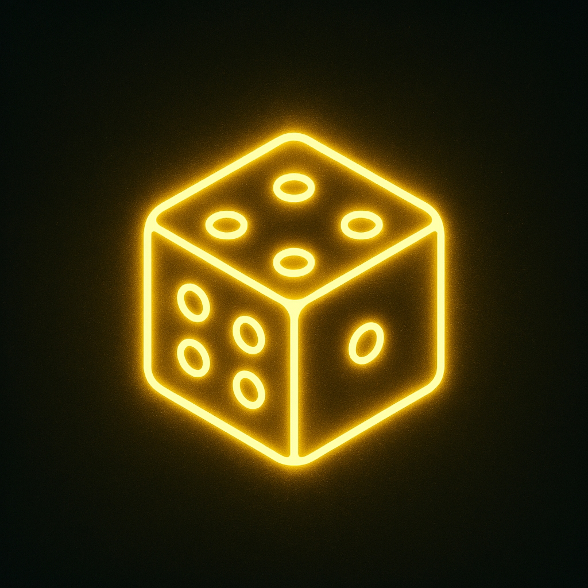
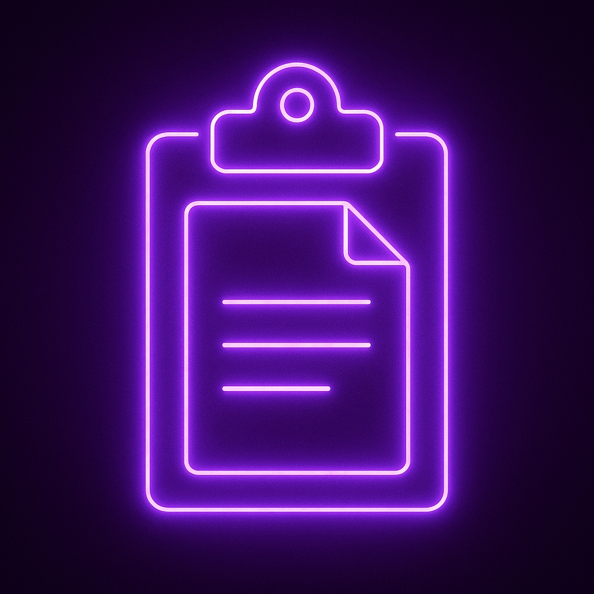
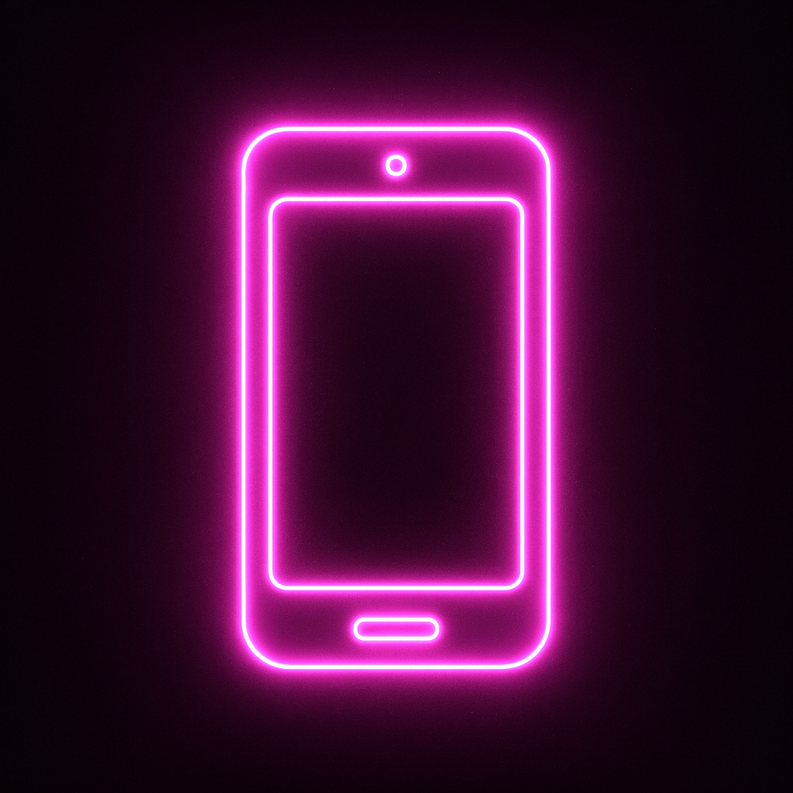
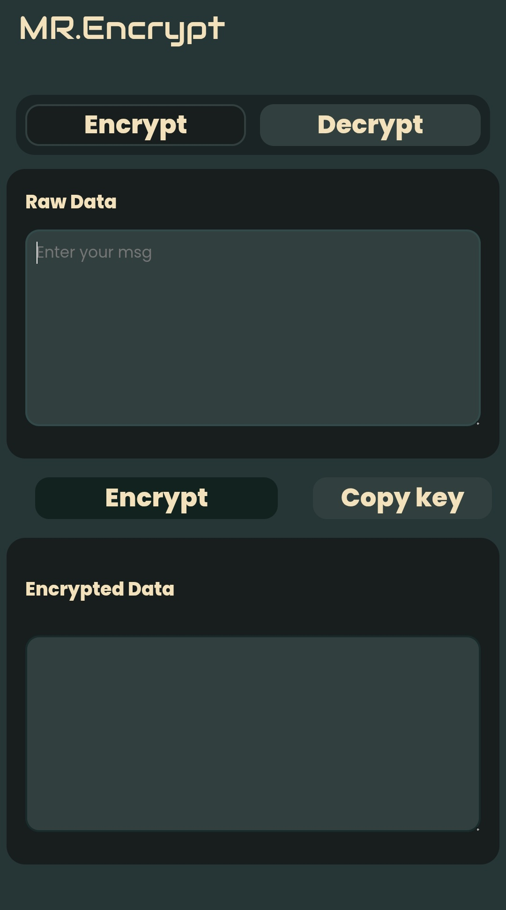

<div style='color:#fff; background-color:#000;'>

# 🔐 MR.Encrypt

<div align="center">


<h2 style="color: #00ff88;">⚡ SECURE • FAST • ENCRYPTED ⚡</h2>

<div style="background: linear-gradient(45deg, #0a0a0a, #1a1a1a); padding: 20px; border-radius: 15px; border: 1px solid #00ff88; margin: 20px 0;">

[](LICENSE.md)
[](https://github.com/SinghNirmal01/MR.Encrypt/stargazers)
[](https://singhnirmal01.github.io/MR.Encrypt/)

</div>

</div>

---

<div style="background: linear-gradient(135deg, #0a0a0a 0%, #1a1a2e 50%, #16213e 100%); padding: 25px; border-radius: 20px; border: 2px solid #00ff88; margin: 20px 0;">

## 🌟 **WHAT IS MR.ENCRYPT?**

<p style="font-size: 18px; color: #00ffff; text-align: center; margin: 20px 0;">
<strong>🔥 THE ULTIMATE TEXT ENCRYPTION POWERHOUSE 🔥</strong>
</p>

Transform your **sensitive data** into **unbreakable codes** with our cutting-edge web-based encryption tool. Whether you're a **cyber security enthusiast**, **privacy advocate**, or just want to send **secret messages** to friends, MR.Encrypt delivers **military-grade** text encryption in a sleek, neon-powered interface.

<div style="text-align: center; margin: 20px 0; padding: 15px; background: #0a0a0a; border-radius: 10px; border: 1px solid #ff0080;">
<strong style="color: #ff0080; font-size: 16px;">💫 NO REGISTRATION • NO DATA STORED • 100% CLIENT-SIDE • ZERO FOOTPRINT 💫</strong>
</div>

</div>

---

<div style="background: linear-gradient(45deg, #0a0a0a, #1a1a1a); padding: 25px; border-radius: 20px; border: 2px solid #00ffff; margin: 20px 0;">

## ⚡ **CYBER FEATURES**

<table style="width: 100%; border-collapse: separate; border-spacing: 10px;">
<tr>
<td align="center" style="background: linear-gradient(135deg, #0a0a0a, #1a1a2e); padding: 8px; border-radius: 15px; border: 1px solid #00ff88;">

<br><strong style="color: #00ff88; font-size: 14px;">⚡ INSTANT ENCRYPT</strong>
<br><span style="color: #888; font-size: 12px;">Lightning-fast encryption</span>
</td>
<td align="center" style="background: linear-gradient(135deg, #0a0a0a, #2e1a1a); padding: 20px; border-radius: 15px; border: 1px solid #ff0080;">

<br><strong style="color: #ff0080; font-size: 14px;">🔥 RAPID DECRYPT</strong>
<br><span style="color: #888; font-size: 12px;">Instant message reveal</span>
</td>

</tr>
<tr>
<td align="center" style="background: linear-gradient(135deg, #0a0a0a, #1a2e2e); padding: 20px; border-radius: 15px; border: 1px solid #00ffff;">

<br><strong style="color: #00ffff; font-size: 14px;">🎯 QUANTUM KEYS</strong>
<br><span style="color: #888; font-size: 12px;">Unique encryption keys</span>
</td>
<td align="center" style="background: linear-gradient(135deg, #0a0a0a, #2e2e1a); padding: 20px; border-radius: 15px; border: 1px solid #ffff00;">

<br><strong style="color: #ffff00; font-size: 14px;">⚡ ONE-CLICK COPY</strong>
<br><span style="color: #888; font-size: 12px;">Seamless clipboard ops</span>
</td>
</tr>
<tr>
<td align="center" style="background: linear-gradient(135deg, #0a0a0a, #2e1a2e); padding: 20px; border-radius: 15px; border: 1px solid #ff4500;">

<br><strong style="color: #ff4500; font-size: 14px;">🛠️ CUSTOM KEYS</strong>
<br><span style="color: #888; font-size: 12px;">Your own encryption</span>
</td><td align="center" style="background: linear-gradient(135deg, #0a0a0a, #1a1a2e); padding: 20px; border-radius: 15px; border: 1px solid #9400d3;">

<br><strong style="color: #9400d3; font-size: 14px; font-weight:800;">📱 CYBER MOBILE</strong>
<br><span style="color: #888; font-size: 12px;">All device compatible</span>
</td></tr>
</table>

</div>

---

<div style="background: linear-gradient(135deg, #0a0a0a 0%, #1a1a2e 100%); padding: 25px; border-radius: 20px; border: 2px solid #ff0080; margin: 20px 0;">

## 🚀 **CYBER PROTOCOL GUIDE**

<div style="display: flex; justify-content: space-around; flex-wrap: wrap;">

<div style="background: linear-gradient(45deg, #0a0a0a, #001a00); padding: 20px; border-radius: 15px; border: 2px solid #00ff88; margin: 10px; flex: 1; min-width: 300px;">

### 🔐 **ENCRYPTION PROTOCOL**

```css
🌐 Access Terminal → singhnirmal01.github.io/MR.Encrypt/
⌨️  Input Secret Data → Raw Data Field
🔒 Execute Encrypt → Click ENCRYPT Button
📋 Extract Cipher → Copy Encrypted Output
🔑 Secure Key Transfer → Copy & Send Key SEPARATELY
```

</div>

<div style="background: linear-gradient(45deg, #0a0a0a, #001a1a); padding: 20px; border-radius: 15px; border: 2px solid #00ffff; margin: 10px; flex: 1; min-width: 300px;">

### 🔓 **DECRYPTION PROTOCOL**

```css
🌐 Access Terminal → singhnirmal01.github.io/MR.Encrypt/
📩 Load Cipher → Paste Encrypted Data
🔧 Configure Key → Click Edit Key
🔑 Input Secret → Paste Received Key
🔓 Execute Decrypt → Click DECRYPT Button
```

</div>

</div>

</div>

---

<div style="background: linear-gradient(135deg, #1a0a0a 0%, #2e1a1a 100%); padding: 25px; border-radius: 20px; border: 2px solid #ff4500; margin: 20px 0;">

## 🛡️ **CYBER SECURITY MATRIX**

<div align="center">

<table style="border-collapse: separate; border-spacing: 15px; width: 100%; text-align:center;">
<tr>
<th style="background: linear-gradient(45deg, #0a0a0a, #001a00); padding: 15px; border-radius: 10px; border: 1px solid #00ff88; color: #00ff88; font-size: 16px;">SECURE PROTOCOLS</th>
<th style="background: linear-gradient(45deg, #0a0a0a, #1a0000); padding: 15px; border-radius: 10px; border: 1px solid #ff0080; color: #ff0080; font-size: 16px;">BREACH RISKS</th>
</tr>
<tr>
<td style="background: linear-gradient(45deg, #0a0a0a, #001100); padding: 15px; border-radius: 10px; border: 1px solid #00ff88; color: #00ff88;">🔄 Separate channel key transmission</td>
<td style="background: linear-gradient(45deg, #0a0a0a, #110000); padding: 15px; border-radius: 10px; border: 1px solid #ff0080; color: #ff0080;">📦 Bundle key with message</td>
</tr>
<tr>
<td style="background: linear-gradient(45deg, #0a0a0a, #001100); padding: 15px; border-radius: 10px; border: 1px solid #00ff88; color: #00ff88;">🎲 Generate unique session keys</td>
<td style="background: linear-gradient(45deg, #0a0a0a, #110000); padding: 15px; border-radius: 10px; border: 1px solid #ff0080; color: #ff0080;">♻️ Reuse identical encryption keys</td>
</tr>
<tr>
<td style="background: linear-gradient(45deg, #0a0a0a, #001100); padding: 15px; border-radius: 10px; border: 1px solid #00ff88; color: #00ff88;">🔒 Private key distribution channels</td>
<td style="background: linear-gradient(45deg, #0a0a0a, #110000); padding: 15px; border-radius: 10px; border: 1px solid #ff0080; color: #ff0080;">📢 Public key broadcast</td>
</tr>
<tr>
<td style="background: linear-gradient(45deg, #0a0a0a, #001100); padding: 15px; border-radius: 10px; border: 1px solid #00ff88; color: #00ff88;">🛡️ Verify key integrity before decrypt</td>
<td style="background: linear-gradient(45deg, #0a0a0a, #110000); padding: 15px; border-radius: 10px; border: 1px solid #ff0080; color: #ff0080;">💾 Store keys in plain text files</td>
</tr>
</table>

</div>

</div>

---

<div style="background: linear-gradient(135deg, #0a0a0a 0%, #1a1a1a 100%); padding: 25px; border-radius: 20px; border: 2px solid #00ffff; margin: 20px 0;">

## 💻 **TECH STACK**

<div align="center" style="margin: 20px 0;">


</div>

</div>

---

<div style="background: linear-gradient(135deg, #1a1a0a 0%, #2e2e1a 100%); padding: 25px; border-radius: 20px; border: 2px solid #ffff00; margin: 20px 0;">

## 📱 **VISUAL INTERFACE**

<div align="center">

### 📱 **MOBILE CYBER TERMINAL**



</div>

</div>

---

<div style="background: linear-gradient(135deg, #0a0a0a 0%, #1a1a2e 100%); padding: 25px; border-radius: 20px; border: 2px solid #9400d3; margin: 20px 0;">

## 🎯 **CYBER USE CASES**

<div style="display: grid; grid-template-columns: repeat(auto-fit, minmax(250px, 1fr)); gap: 15px; margin: 20px 0;">

<div style="background: linear-gradient(45deg, #0a0a0a, #1a0a1a); padding: 20px; border-radius: 15px; border: 1px solid #ff0080; text-align: center;">
<h4 style="color: #ff0080; margin: 0;">🎮 GAMING WARFARE</h4>
<p style="color: #ccc; font-size: 14px;">Secret strategy coordination</p>
</div>

<div style="background: linear-gradient(45deg, #0a0a0a, #001a1a); padding: 20px; border-radius: 15px; border: 1px solid #00ffff; text-align: center;">
<h4 style="color: #00ffff; margin: 0;">💼 CORPORATE INTEL</h4>
<p style="color: #ccc; font-size: 14px;">Secure business communications</p>
</div>

<div style="background: linear-gradient(45deg, #0a0a0a, #1a1a00); padding: 20px; border-radius: 15px; border: 1px solid #ffff00; text-align: center;">
<h4 style="color: #ffff00; margin: 0;">👥 SOCIAL CRYPTO</h4>
<p style="color: #ccc; font-size: 14px;">Encrypted friend messaging</p>
</div>

<div style="background: linear-gradient(45deg, #0a0a0a, #001a00); padding: 20px; border-radius: 15px; border: 1px solid #00ff88; text-align: center;">
<h4 style="color: #00ff88; margin: 0;">🎓 CYBER EDUCATION</h4>
<p style="color: #ccc; font-size: 14px;">Learn encryption fundamentals</p>
</div>

</div>

</div>

---

<div align="center" style="background: linear-gradient(135deg, #0a0a0a 0%, #1a1a1a 100%); padding: 30px; border-radius: 20px; border: 2px solid #00ff88; margin: 20px 0;">

## 🚀 **LIVE CYBER TERMINAL**

<div style="margin: 20px 0; padding: 20px; background: #000; border-radius: 10px; border: 1px solid #00ffff;">
<h3 style="color: #00ffff; margin: 0; text-shadow: 0 0 10px #00ffff;">⚡ DEPLOY NOW ⚡</h3>
<a href="https://singhnirmal01.github.io/MR.Encrypt/" style="color: #00ff88; font-size: 18px; text-decoration: none; text-shadow: 0 0 10px #00ff88;">🔗 **ENTER THE MATRIX** 🔗</a>
</div>

---

### 🔥 **SHOW YOUR CYBER SUPPORT** 🔥

<div style="margin: 20px 0;">

[](https://github.com/SinghNirmal01/MR.Encrypt/stargazers)
[](https://github.com/SinghNirmal01/MR.Encrypt/fork)
[](https://github.com/SinghNirmal/MR.Encrypt/issues)

</div>

---

<div style="background: #000; padding: 20px; border-radius: 15px; border: 1px solid #ff0080; margin: 20px 0;">
<h3 style="color: #ff0080; text-align: center; margin: 0; text-shadow: 0 0 10px #ff0080;">
🔒 **PRIVACY FORTRESS: ALL ENCRYPTION HAPPENS IN YOUR BROWSER** 🔒
</h3>
<p style="color: #00ffff; text-align: center; margin: 10px 0; font-size: 14px;">
NO DATA TRANSMISSION • ZERO SERVER STORAGE • MAXIMUM PRIVACY
</p>
</div>

**CRAFTED WITH 💚 BY CODERWA**

[](https://github.com/SinghNirmal01)

</div>

---

## 📄 **OPEN SOURCE LICENSE**

This project is licensed under the **MIT License** - see the [LICENSE.md](LICENSE.md) file for details.

<div align="center" style="margin: 20px 0; padding: 15px; background: linear-gradient(45deg, #0a0a0a, #1a1a1a); border-radius: 10px; border: 1px solid #00ff88;">
<em style="color: #00ff88;">Made with ⚡ by the Cyber Underground</em>
</div>

</div>
