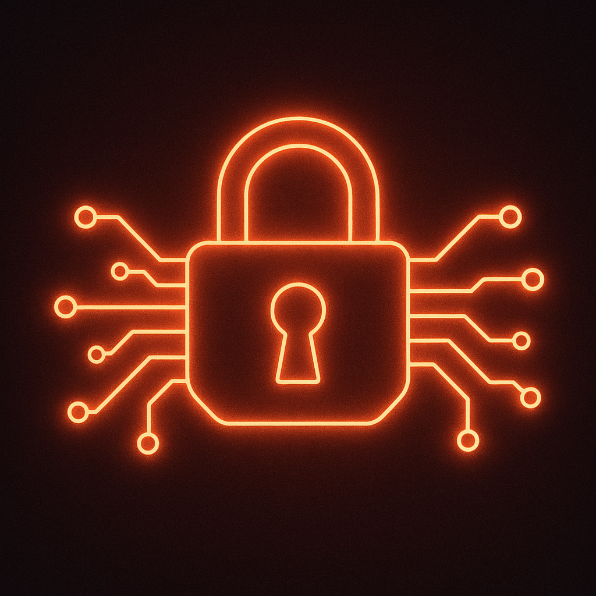

# 🔐 MR.Encrypt

<div align="center">


**A powerful, simple, and secure web-based encryption tool**

[](LICENSE.md)
[](https://github.com/your-username/MR.Encrypt/stargazers)
[](https://github.com/your-username/MR.Encrypt/network)
[](https://your-username.github.io/MR.Encrypt/)

</div>

---

## 🚀 What is MR.Encrypt?

MR.Encrypt is your go-to solution for **secure text communication**! Whether you're sharing sensitive information, creating fun secret messages with friends, or just want to keep your data private, our intuitive web-based tool makes encryption accessible to everyone.

> **No registration required • No data stored • 100% client-side processing**

---

## ✨ Key Features

<table>
<tr>
<td align="center">

<br><strong>Instant Encryption</strong>
<br>Encrypt text with one click
</td>
<td align="center">

<br><strong>Easy Decryption</strong>
<br>Decrypt messages instantly
</td>
<td align="center">

<br><strong>Random Keys</strong>
<br>Unique encryption keys
</td>
</tr>
<tr>
<td align="center">

<br><strong>One-Click Copy</strong>
<br>Copy keys & text easily
</td>
<td align="center">

<br><strong>Custom Keys</strong>
<br>Use your own decryption key
</td>
<td align="center">

<br><strong>Mobile Ready</strong>
<br>Works on all devices
</td>
</tr>
</table>

---

## 🎯 Quick Start Guide

### 🔐 For the Sender (Encrypting)

```
1️⃣ Visit → https://your-username.github.io/MR.Encrypt/
2️⃣ Type your secret message in the "Raw Data" box
3️⃣ Click "Encrypt" 🔒
4️⃣ Copy the encrypted message and send it
5️⃣ Click "Copy Key" and send the key SEPARATELY!
```

### 🔓 For the Receiver (Decrypting)

```
1️⃣ Visit → https://your-username.github.io/MR.Encrypt/
2️⃣ Paste the encrypted message in "Raw Data"
3️⃣ Click "Edit Key" and paste the received key
4️⃣ Click "Decrypt" 🔓
5️⃣ Read your secret message!
```

---

## 🛡️ Security Best Practices

<div align="center">

| ✅ DO | ❌ DON'T |
|-------|----------|
| Send the key through a different channel | Send key and message together |
| Use unique keys for different messages | Reuse the same key multiple times |
| Verify the key before decrypting | Share keys in public channels |
| Keep keys private and secure | Store keys in plain text files |

</div>

---

## 🛠️ Built With

<div align="center">


</div>

---

## 📱 Screenshots

<div align="center">


### 📱 Mobile View


</div>

---

## 🚀 Live Demo

**Try it now:** [MR.Encrypt Live Demo](https://your-username.github.io/MR.Encrypt/)

---

## 💡 Use Cases

- 🎮 **Gaming**: Share secret strategies with teammates
- 💼 **Business**: Secure sensitive information exchange  
- 👥 **Friends**: Create fun encrypted messages
- 🎓 **Education**: Learn about encryption concepts
- 🏠 **Personal**: Protect private notes and data

---

## 🤝 Contributing

We love contributions! Here's how you can help:

1. 🍴 Fork the repository
2. 🌿 Create a feature branch (`git checkout -b feature/amazing-feature`)
3. 💾 Commit your changes (`git commit -m 'Add amazing feature'`)
4. 📤 Push to the branch (`git push origin feature/amazing-feature`)
5. 🎯 Open a Pull Request

---

## 📄 License

This project is licensed under the **MIT License** - see the [LICENSE.md](LICENSE.md) file for details.

---

## ⭐ Show Your Support

If you found MR.Encrypt helpful, please consider:

- ⭐ **Starring** this repository
- 🍴 **Forking** it for your own projects  
- 🐛 **Reporting** any issues you find
- 💡 **Suggesting** new features

---

<div align="center">

**Made with ❤️ by [Your Name](https://github.com/your-username)**

[](https://github.com/your-username)

---

### 🔒 Remember: Your privacy is our priority. All encryption happens in your browser - no data ever leaves your device!

</div>